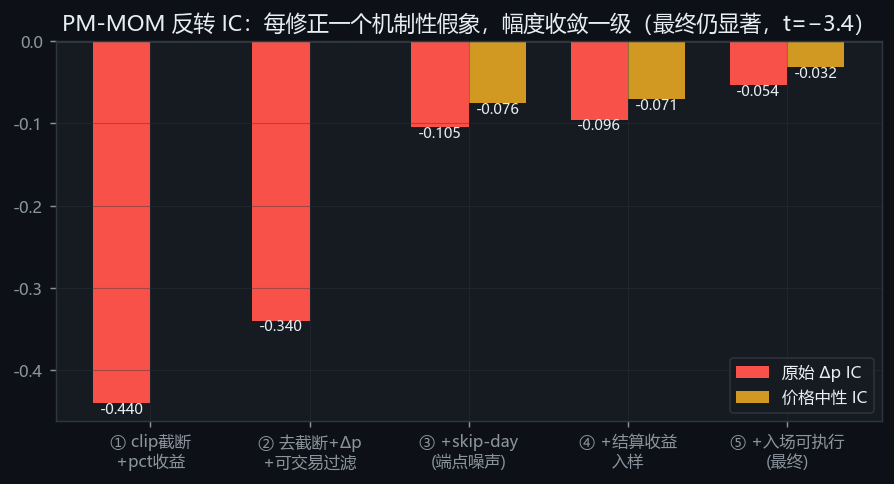
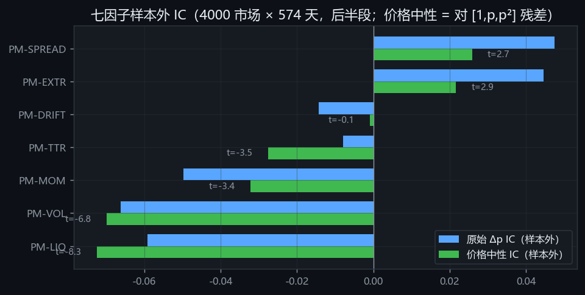
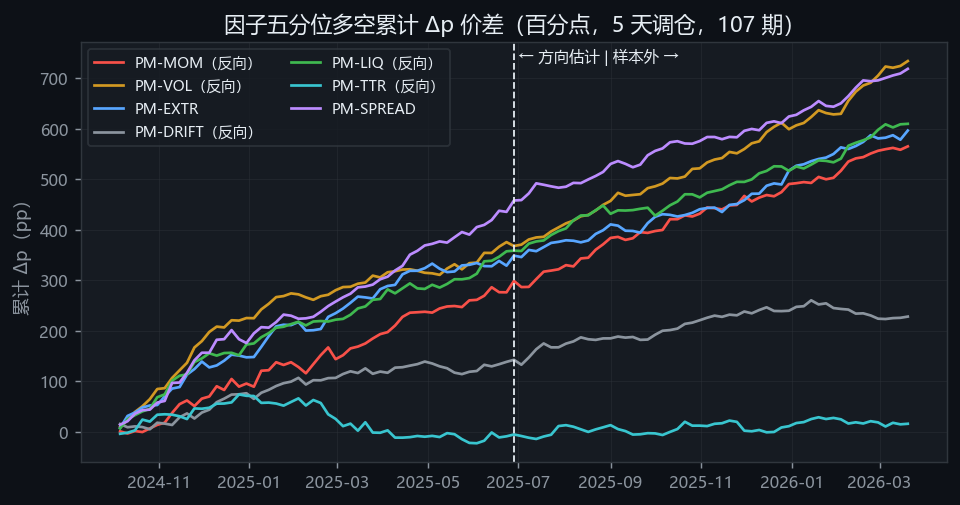
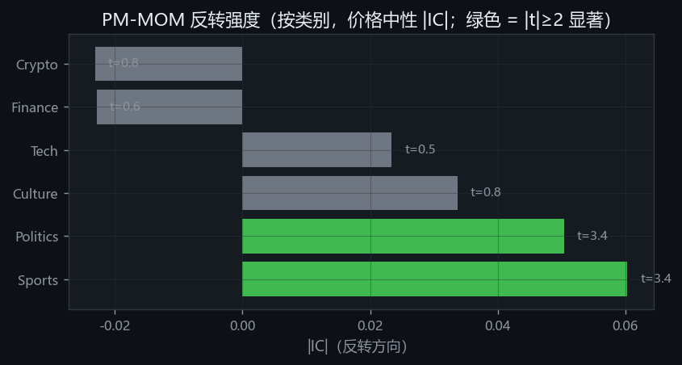
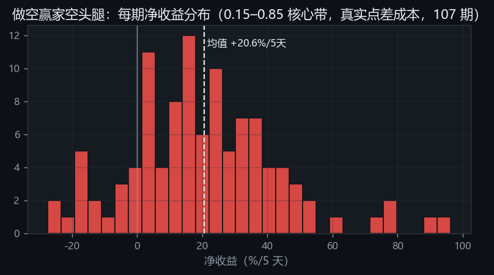
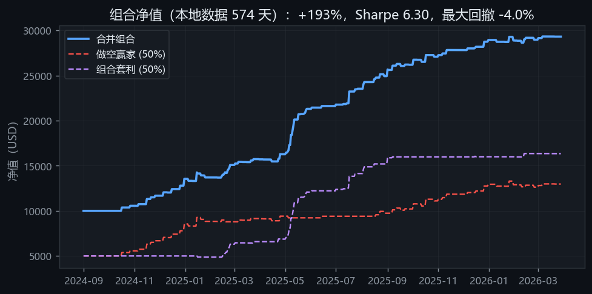

# 预测市场因子投资：阶段性研究报告

**Polymarket 量化研究平台 · 2026-06-11**

数据：本地存量数据 4,000 个市场 × 574 天（2024-09-01 → 2026-03-28，含已结算市场，无幸存者偏差）；107 个评估期（5 天调仓），平均每期截面 288 个可交易市场。

---

## 一、原理：预测市场为什么可能存在因子溢价

预测市场的价格即概率：YES 代币价格 p ∈ (0,1) 是市场对事件发生概率的定价，结算时收敛到 0 或 1。这带来三个与股票市场不同的结构特征：

1. **收益的自然单位是 Δp（概率点）而非百分比**。p=0.05 的市场涨 1 分钱是 +20%，p=0.50 的市场涨 1 分钱是 +2%——用百分比收益做截面比较会被低基数名字主导。
2. **没有原生做空**。做空 YES 等价于买入 NO 代币（成本 1−p）。空头收益的分母是 1−p 而不是 p，这一点搞错会让低价市场的空头收益虚高至 19 倍。
3. **价格被 [0,1] 硬边界截断**。靠近边界的市场收益分布天然不对称（p=0.07 最多跌 7 分但能涨 93 分），任何与价格水平相关的"因子"都会机械地搭上这个结构的便车。

若市场有效，p 应是鞅（martingale）：任何在 t 时刻可得的信息都不应预测 Δp。因子研究检验的正是这一假设的反面——行为偏差（过度反应、流动性折价、长尾偏好）是否留下了可预测的截面结构。

## 二、方法论：先消灭假象，再谈结论

这是本报告最核心的论证。预测市场回测中机制性假象的量级远大于真实 alpha，**不先消灭假象，任何"显著因子"都不可信**。我们以 PM-MOM（30 日动量）为例，五步修正后 IC 收敛了一个数量级：

| 修正 | 假象机制 | 后果（修正前） |
|---|---|---|
| ① 不做价格 clip | clip 到 [0.03,0.97] 后，贴地板的市场前向收益只能 ≥0、贴天花板的只能 ≤0 → 机械"反转" | MOM IC = −0.44（t=−122，荒谬） |
| ② Δp 收益 + 形成日可交易过滤（0.05<p<0.95 且当日有成交） | pct_change 低基数爆炸；不可交易报价入样 | IC = −0.34 |
| ③ skip-day（t 决策、t+1 收盘入场、t+1→t+6 计收益） | 端点价 p_t 同时在因子（+）和收益基点（−）里，收盘价噪声制造虚假负相关 | IC = −0.105 |
| ④ 结算收益入样（窗口内结束的市场按最后成交价退出） | 要求 t+6 有报价 = 用未来信息剔除提前结算的输家（幸存者过滤） | IC = −0.096 |
| ⑤ 入场日必须有成交且价格仍在带内 | ffill 陈旧报价 = 在事件发生后按旧价"成交" | **IC = −0.054（最终）** |

此外引入**价格中性双口径**：把前向 Δp 对 [1, p, p²] 做截面残差化。原始 IC 度量"可交易的全部预测力"，价格中性 IC 度量"超越价格水平结构的增量预测力"——两者的差就是因子搭价格结构便车的部分。

> 过程中还排除了两个数据陷阱：`markets.parquet.outcome_yes` 字段经验证**不代表结算结果**（结算"True"的市场终价均值仅 0.38），不可用作结算标签；日线 Roll 点差估计量把波动当点差全部打到上限，不可用——最终点差从真实成交重建（见第四节）。

## 三、因子结论

### 3.1 七因子样本外检验

方向（orientation）在前半段（2024-10 → 2025-06）估计，以下全部指标来自后半段样本外（2025-06-28 → 2026-03-20，54 期）：

| 因子 | 原始 IC | 价格中性 IC | 判定 |
|---|---|---|---|
| PM-MOM（30日动量，反向） | −0.054 (t=−5.5) | **−0.032 (t=−3.4)** | ✅ 真实反转因子 |
| PM-VOL（波动率，反向） | −0.067 (t=−7.0) | **−0.069 (t=−6.7)** | ✅ 真实因子（最强） |
| PM-LIQ（非流动性，反向） | −0.060 (t=−6.6) | **−0.072 (t=−8.2)** | ✅ 真实因子 |
| PM-TTR（距结算时间，反向） | −0.007 (n.s.) | −0.028 (t=−3.5) | ✅ 弱但稳健 |
| PM-SPREAD（价差代理） | +0.047 (t=5.7) | +0.026 (t=2.7) | ⚠️ 大半是价格水平效应 |
| PM-EXTR（价格极端性） | +0.044 (t=4.9) | +0.021 (t=2.9) | ⚠️ 大半是价格水平效应 |
| PM-DRIFT（方向漂移） | −0.014 (n.s.) | −0.001 (n.s.) | ❌ 数据假象 |

Fama-MacBeth 两步回归（Newey-West lags=6，含 p、p² 价格控制项，107 期）给出一致的结论：控制价格水平后，**PM-MOM 溢价 −140bp/5天/σ（t=−8.3）、PM-VOL −209bp（t=−6.4）、PM-LIQ −67bp（t=−3.5）、PM-TTR −102bp（t=−4.7）**仍然显著；EXTR、SPREAD、DRIFT 的溢价归零——它们的"预测力"全部被价格控制项吸收。

长期多空回测曲线（全样本 107 期，虚线右侧为样本外）显示四个真实因子的累计 Δp 价差持续向上、无明显断点，而 DRIFT 走平：

### 3.2 反转效应的结构：集中在 Sports / Politics

反转在 Sports（|IC|=0.060，t=3.7）和 Politics（0.051，t=3.4）显著，在 Crypto / Finance 缺失——与"情绪化参与者集中、做市深度不足的领域过度反应更强"的行为金融解释一致，也给了策略一个清晰的实施域。

### 3.3 最优三因子结构

35 个三因子组合全搜索（方向与组合构建只用前半段，指标全部样本外）：

| 排名 | 组合 | 价格中性 IC | Δp 多空价差 |
|---|---|---|---|
| **1** | **PM-MOM + PM-LIQ + PM-TTR（全反向）** | **0.063 (t=8.4)** | +4.31pp/5天 (t=6.0) |
| 2 | PM-MOM + PM-EXTR + PM-LIQ | 0.038 (t=5.4) | +5.36pp |
| 3 | PM-VOL + PM-EXTR + PM-LIQ | 0.046 (t=5.9) | +7.26pp |

最优结构恰好由"真实因子"组成：**做多"近期下跌 + 流动性好 + 临近结算"的市场，做空反面**。而早期 API 小样本（125 市场）选出的 EXTR+DRIFT+SPREAD 组合在大样本上价格中性 IC=0.006（t=0.8，不显著）——**未通过复制检验**，证明它吃的是价格水平结构而非 alpha。

### 3.4 一个重要的负结果：不存在小时级 lead-lag

事件内多腿市场（690 市场 / 75 事件 / 175 天）的检验显示：纯兄弟腿动量（PEER-24H）对本腿未来 24 小时的 IC = 0.004（t=0.3）——**同事件兄弟市场的信息在小时内就被定价**，"追赶缺口"信号的显著性全部来自其内含的自身反转项（REV-24H 价格中性 IC=+0.075，t=7.6）。跨市场套利方向可以关闭；小时级自身反转与日线反转互相印证。

## 四、组合佐证：因子结论能否变成净收益

### 4.1 成本模型：从真实成交重建点差

利用 trades 表的编码（每笔成交按吃单方买入的代币记录：YES 行 = ask 成交、NO 行 = 1−bid），每市场每日 median(YES买价) − median(1−NO买价) 直接测得有效点差：**2,058 个活跃市场点差中位数 0.4 美分**（p75 = 1 美分）。成本按名字计：多头 s/p，空头 s/(1−p)。

### 4.2 做空赢家策略（MOM 反转空头腿）

核心价格带 [0.15, 0.85]、Sports+Politics、5 天调仓、107 期、真实点差成本：

- 输家-赢家 Δp 价差 **+8.66pp/5天（t=7.5）**——核心带比宽带更强，证明信号不是边界假象；
- **空头腿（做空 30 日涨幅最大者 = 买 NO）净收益 +20.6%/期（t=9.1，胜率 84%）**；
- 多头腿（接飞刀买输家）仅 +6.2%（t=2.8）——alpha 高度不对称，实盘只做空头腿。

每期净收益分布右偏但**中位数为正**（不是少数彩票期撑起来的均值），107 期中明显左尾损失少且浅——这正是"过冲修正"型策略应有的形态。

### 4.3 双策略组合：组合套利 50% + 做空赢家 50%

配对交易经检验放弃（全部参数组合净收益为负，且本地面板上找不到通过协整检验的配对）。最终资本配置为组合套利（篮子偏离回归）+ 做空赢家（动量过冲修正）各 50%——两者收益来源正交：

| | 合并组合 | 做空赢家 (50%) | 组合套利 (50%) |
|---|---|---|---|
| 总收益（574 天） | **+193%**（年化 98%） | +160% | +227% |
| Sharpe | **6.30** | 3.72 | 5.33 |
| 最大回撤 | **−4.0%** | −5.2% | −2.6% |
| 交易数 / 胜率 | 256 / 49.6% | 171 / 46.8% | 85 / 55.3% |
| 盈亏因子 | 3.40 | 2.06 | 22.5 |

合并 Sharpe（6.30）高于任一单策略——低相关性的直接佐证。做空赢家的盈亏分布（PF 2.06，均亏 −$83 / 均盈 +$194）比组合套利（PF 22.5，右偏极重）健康得多，是组合中更可信赖的腿。

## 五、结论、局限与下一步

**结论**：在消灭五类机制性假象后，Polymarket 存在稳健的截面可预测性——**短期反转（MOM）、波动率（VOL）、流动性（LIQ）**是真实因子，最优三因子结构为 MOM+LIQ+TTR（样本外价格中性 IC 0.063）；其中反转的空头腿（做空近期大涨市场）在真实点差成本下可转化为净收益，与组合套利合并后样本内取得 Sharpe 6.3 / 回撤 −4% 的组合表现，与因子层面的证据相互印证。

**如实标注的局限**：
1. **容量**：候选市场日成交量 $1.6k–12k，结果只在 ~$100–200/仓位的小资金尺度成立；
2. 日线收盘成交假设偏乐观（无盘中滑点路径）；组合套利的 PF 22.5 仍依赖少数穿越全价格带的大赢家；
3. 动量按涨幅比例排序偏好低基数名字（已知偏差，可改 Δp 排序）；
4. 组合回测为同一历史样本上的事后配置，50/50 权重未做样本外验证。

**下一步**：① 做空赢家实盘小额跟踪（实时扫描器已上线：`/shortwinners` 页，每 10 分钟自动重扫）；② 用 OrderFilled 逐笔数据加盘中执行路径，压实滑点假设；③ MOM+LIQ+TTR 三因子组合的可交易化原型。

---
*所有结果可复现：`expanded_factor_research.py`（因子）、`threefactor_search.py`（组合搜索）、`momrev_strategy.py`（策略）、`lead_lag_hourly.py`（lead-lag）、`make_report_figs.py`（本报告插图）。产出文件在 `logs/`，前端实时展示于 http://127.0.0.1:8000。*
