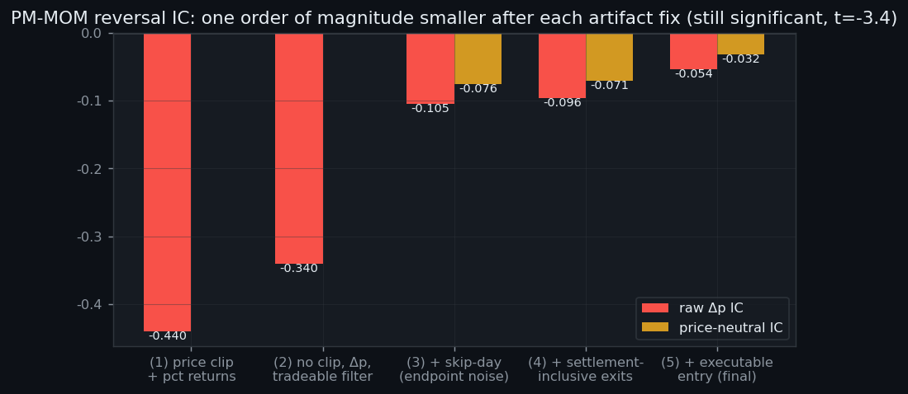
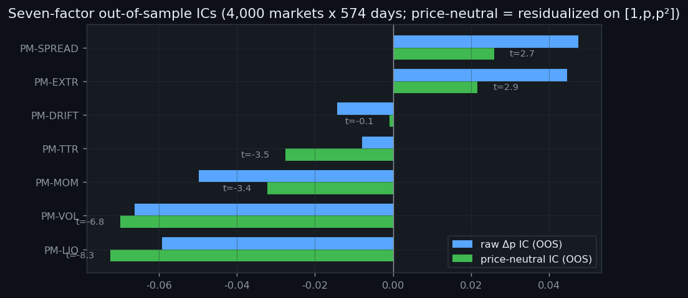
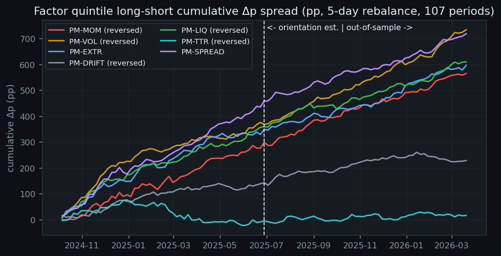
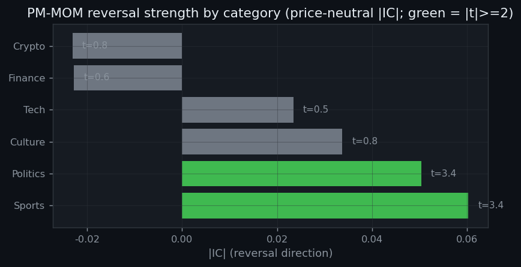
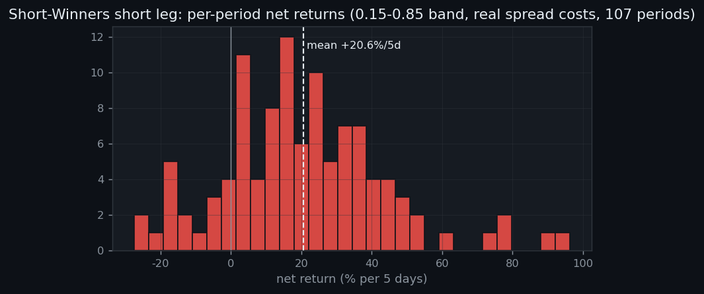
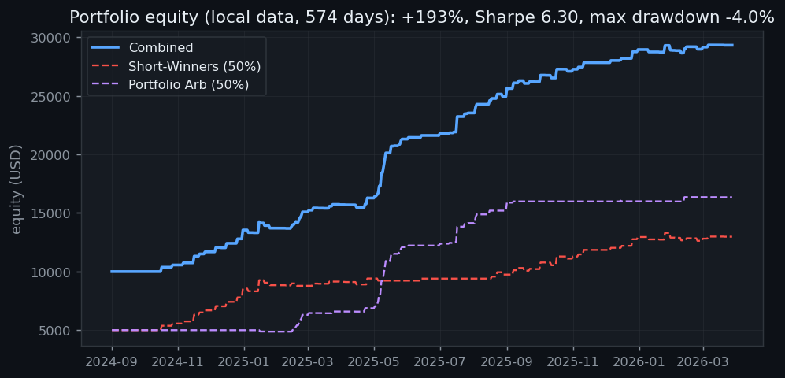

# Prediction-Market Factor Investing: Interim Research Report

**Polymarket Quantitative Research Platform · 2026-06-11**

Data: local archive of 4,000 markets × 574 days (2024-09-01 → 2026-03-28, including resolved markets — no survivorship bias); 107 evaluation periods (5-day rebalance), average tradeable cross-section of 288 markets per period.

---

## 1. Principles: why factor premia might exist in prediction markets

In a prediction market, price *is* probability: the YES-token price p ∈ (0,1) is the market's estimate of the event probability, converging to 0 or 1 at settlement. This creates three structural features absent from equity markets:

1. **The natural return unit is Δp (probability points), not percentage return.** A one-cent move is +20% for a market at p=0.05 but +2% at p=0.50 — percentage returns in the cross-section are dominated by low-base names.
2. **There is no native shorting.** Shorting YES means buying the NO token at cost 1−p. The short-leg return denominator is 1−p, not p; getting this wrong inflates short returns on low-priced markets by up to 19×.
3. **Prices are hard-bounded by [0,1].** Return distributions near the boundaries are mechanically asymmetric (a market at p=0.07 can lose at most 7 points but gain 93), so any "factor" correlated with the price level free-rides on this structure.

If the market is efficient, p should be a martingale: no information available at time t should predict Δp. Factor research tests the converse — whether behavioral biases (overreaction, liquidity discounts, longshot preference) leave a predictable cross-sectional structure.

## 2. Methodology: kill the artifacts before claiming conclusions

This is the central argument of the report. In prediction-market backtests, mechanical artifacts are an order of magnitude larger than any genuine alpha — **no "significant factor" is credible until the artifacts are eliminated.** Using PM-MOM (30-day momentum) as the running example, five successive corrections shrank the IC by an order of magnitude:

| Fix | Artifact mechanism | Consequence (before fix) |
|---|---|---|
| (1) No price clipping | Clipping to [0.03, 0.97] censors forward returns: floor-pinned markets can only go up, cap-pinned only down → mechanical "reversal" | MOM IC = −0.44 (t=−122, absurd) |
| (2) Δp returns + formation-day tradeability filter (0.05<p<0.95 with same-day volume) | pct_change explodes on low bases; untradeable quotes enter the sample | IC = −0.34 |
| (3) Skip-day (decide at t, enter at the t+1 close, measure t+1→t+6) | The endpoint price p_t sits in the factor score (+) and the return base (−); close-price noise manufactures spurious negative correlation | IC = −0.105 |
| (4) Settlement-inclusive exits (markets ending inside the window exit at their final traded price) | Requiring a quote at t+6 silently drops early-settled losers — a survival filter conditioned on future information | IC = −0.096 |
| (5) Executable entry (the entry day must trade, with price still inside the band) | Forward-filled stale quotes let the backtest "fill" at pre-news prices | **IC = −0.054 (final)** |

We also adopt a **dual-measure IC convention**: forward Δp is cross-sectionally residualized on [1, p, p²]. The raw IC measures total tradeable predictability; the price-neutral IC measures incremental predictability beyond price-level structure — the gap between the two is the part of a factor that merely free-rides on price structure.

> Two data traps were also documented along the way: the `outcome_yes` field in `markets.parquet` was validated to **not** encode the settlement outcome (markets labeled "True" have an average final price of 0.38), so it must not be used as a settlement label; and the daily-frequency Roll spread estimator is unusable (daily volatility dwarfs the spread — all estimates hit the cap). Spreads are instead rebuilt from actual fills (Section 4).

## 3. Factor conclusions

### 3.1 Seven factors, out of sample

Factor orientation is estimated on the first half of the sample (2024-10 → 2025-06); every statistic below comes from the second half, out of sample (2025-06-28 → 2026-03-20, 54 periods):

| Factor | Raw IC | Price-neutral IC | Verdict |
|---|---|---|---|
| PM-MOM (30d momentum, reversed) | −0.054 (t=−5.5) | **−0.032 (t=−3.4)** | ✅ Genuine reversal factor |
| PM-VOL (volatility, reversed) | −0.067 (t=−7.0) | **−0.069 (t=−6.7)** | ✅ Genuine (strongest) |
| PM-LIQ (illiquidity, reversed) | −0.060 (t=−6.6) | **−0.072 (t=−8.2)** | ✅ Genuine |
| PM-TTR (time to resolution, reversed) | −0.007 (n.s.) | −0.028 (t=−3.5) | ✅ Weak but robust |
| PM-SPREAD (spread proxy) | +0.047 (t=5.7) | +0.026 (t=2.7) | ⚠️ Mostly price-level effect |
| PM-EXTR (price extremity) | +0.044 (t=4.9) | +0.021 (t=2.9) | ⚠️ Mostly price-level effect |
| PM-DRIFT (directional drift) | −0.014 (n.s.) | −0.001 (n.s.) | ❌ Data artifact |

Fama-MacBeth two-step regressions (Newey-West lags=6, with p and p² as price controls, 107 periods) corroborate: controlling for price level, **PM-MOM carries a premium of −140 bp/5d per σ (t=−8.3), PM-VOL −209 bp (t=−6.4), PM-LIQ −67 bp (t=−3.5), PM-TTR −102 bp (t=−4.7)** — all significant; the premia of EXTR, SPREAD and DRIFT collapse to zero once the price controls absorb their apparent predictability.

Long-horizon long-short backtests (all 107 periods; the dashed line marks the out-of-sample boundary) show the four genuine factors compounding steadily with no regime break, while DRIFT goes flat:

### 3.2 Structure of the reversal effect: concentrated in Sports / Politics

Reversal is significant in Sports (|IC|=0.060, t=3.7) and Politics (0.051, t=3.4) and absent in Crypto / Finance — consistent with the behavioral interpretation that overreaction is strongest where emotional participation is high and market-making depth is thin. It also pins down a clean implementation domain for the strategy.

### 3.3 The optimal three-factor structure

An exhaustive search over all 35 three-factor combinations (orientation and construction use only the first half; all metrics are out of sample):

| Rank | Combination | Price-neutral IC | Δp L/S spread |
|---|---|---|---|
| **1** | **PM-MOM + PM-LIQ + PM-TTR (all reversed)** | **0.063 (t=8.4)** | +4.31 pp/5d (t=6.0) |
| 2 | PM-MOM + PM-EXTR + PM-LIQ | 0.038 (t=5.4) | +5.36 pp |
| 3 | PM-VOL + PM-EXTR + PM-LIQ | 0.046 (t=5.9) | +7.26 pp |

The optimal structure is built entirely from the genuine factors: **long "recently fallen + liquid + near-resolution" markets, short the opposite.** By contrast, the EXTR+DRIFT+SPREAD combination selected on the earlier 125-market API sample fails replication on the large panel (price-neutral IC = 0.006, t=0.8) — proof that it was riding price-level structure, not alpha.

### 3.4 An important negative result: no hourly lead-lag

Within multi-leg events (690 markets / 75 events / 175 days), pure sibling momentum (PEER-24H) has an IC of 0.004 (t=0.3) for the next 24 hours — **information from sibling markets is priced in within the hour.** The apparent significance of a "catch-up gap" signal comes entirely from its embedded own-reversal term (REV-24H price-neutral IC = +0.075, t=7.6). The cross-market arbitrage direction can be closed; hourly self-reversal independently corroborates the daily reversal factor.

## 4. Portfolio corroboration: do the factor conclusions survive net of costs?

### 4.1 Cost model: effective spreads rebuilt from actual fills

Exploiting the trades-table encoding (each fill is recorded under the token the taker bought: YES rows print at the ask, NO rows at 1−bid), the per-market daily median(YES-buy) − median(1−NO-buy) measures the effective spread directly: **median 0.4¢ across 2,058 active markets** (p75 = 1¢). Costs are charged per name: s/p for longs, s/(1−p) for shorts.

### 4.2 The Short-Winners strategy (reversal short leg)

Core price band [0.15, 0.85], Sports+Politics, 5-day rebalance, 107 periods, real spread costs:

- Loser-minus-winner Δp spread of **+8.66 pp/5d (t=7.5)** — stronger in the core band than in the wide band, confirming the signal is not a boundary artifact;
- **The short leg (short the largest 30-day gainers = buy NO) nets +20.6% per period (t=9.1, 84% win rate)**;
- The long leg (catching falling knives) earns only +6.2% (t=2.8) — the alpha is highly asymmetric, so live implementation takes the short leg only.

The per-period net return distribution is right-skewed but with a **positive median** (the mean is not propped up by a few lottery periods), and the left tail is shallow — exactly the shape an "overshoot correction" strategy should have.

### 4.3 The two-strategy portfolio: Portfolio Arb 50% + Short-Winners 50%

Pair trading was dropped after testing (negative net returns across every parameter set, and no cointegrated pairs survive on the local panel). The final allocation pairs portfolio arbitrage (basket-deviation mean reversion) with Short-Winners (momentum-overshoot correction) at 50% each — orthogonal return sources:

| | Combined | Short-Winners (50%) | Portfolio Arb (50%) |
|---|---|---|---|
| Total return (574 days) | **+193%** (98% annualized) | +160% | +227% |
| Sharpe | **6.30** | 3.72 | 5.33 |
| Max drawdown | **−4.0%** | −5.2% | −2.6% |
| Trades / win rate | 256 / 49.6% | 171 / 46.8% | 85 / 55.3% |
| Profit factor | 3.40 | 2.06 | 22.5 |

The combined Sharpe (6.30) exceeds either single strategy — direct evidence of low correlation. Short-Winners has the healthier P&L distribution (PF 2.06, average loss −$83 / average win +$194) versus portfolio arb's heavily right-skewed PF 22.5, making it the more trustworthy leg.

## 5. Conclusions, limitations, next steps

**Conclusions.** After eliminating five classes of mechanical artifacts, Polymarket exhibits robust cross-sectional predictability: **short-horizon reversal (MOM), volatility (VOL) and illiquidity (LIQ)** are genuine factors; the optimal three-factor structure is MOM+LIQ+TTR (out-of-sample price-neutral IC 0.063). The reversal short leg converts into net returns under real spread costs, and combined with portfolio arbitrage delivers Sharpe 6.3 with a −4% maximum drawdown in sample — portfolio evidence and factor evidence corroborate each other.

**Honestly stated limitations:**
1. **Capacity**: candidate markets trade $1.6k–12k per day; results hold only at ~$100–200 per position;
2. Daily-close fill assumptions are optimistic (no intraday slippage path); portfolio arb's PF of 22.5 still depends on a few full-band winners;
3. Ratio-based momentum ranking favors low-base "penny-pump" names (a known bias; Δp ranking is the alternative);
4. The 50/50 weighting is an in-sample, ex-post allocation that has not been validated out of sample.

**Next steps:** (1) small-scale live tracking of Short-Winners (the live scanner is deployed at `/shortwinners`, auto-rescanning every 10 minutes); (2) intraday execution paths from OrderFilled tick data to harden the slippage assumptions; (3) a tradeable prototype of the MOM+LIQ+TTR three-factor portfolio.

---
*All results are reproducible: `expanded_factor_research.py` (factors), `threefactor_search.py` (combination search), `momrev_strategy.py` (strategy), `lead_lag_hourly.py` (lead-lag), `make_report_figs_en.py` (figures for this report). Output files live in `logs/`; the live front end runs at http://127.0.0.1:8000.*
